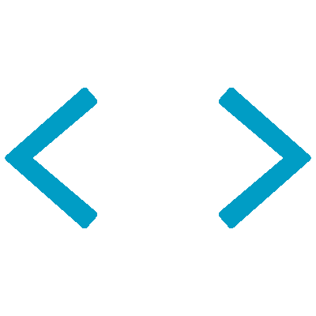
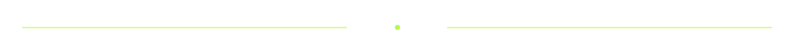

<h1 align="center">
  
  Hi, Nice to meet you.
  
</h1>
<h3 align="center">
  I am a Senior Full Stack Developer.
</h3>
 

  

 

  

 
<h3 align="center"> Here are my skills</h3>
  <table>
    <tr>
      <td valign="center" width="100px"><b>Frontend<b></td>
      <td valign="center" width="100px"><b>Backend<b></td>
      <td valign="center" width="100px"><b>Dev<b></td>
    </tr>
    <tr>
      <td valign="center" align="center" width="300px">
         
        
         
        
         
         
         
         
         
         
         
         
        
      </td>      
      <td valign="center" align="center" width="300px">
         
         
                
         
         
         
         
         
         
         
         
         
         
         
      </td>
      <td valign="center" align="center" width="300px">
         
         
         
         
         
         
         
         
         
         
      </td>
    </tr>
  </table>

  

 
<h3>🏆 Github Profile Trophy</h3>

  

  

  

  

 
  <h2 align="center">
    
      How to reach me
    
  </h2>
   

  
  &nbsp;&nbsp;&nbsp;&nbsp;&nbsp;&nbsp;
  
  &nbsp;&nbsp;&nbsp;&nbsp;&nbsp;&nbsp;
  
  &nbsp;&nbsp;&nbsp;&nbsp;&nbsp;&nbsp;
  

<h2 align="center"> Thanks for visiting my profile. </h2>

  

